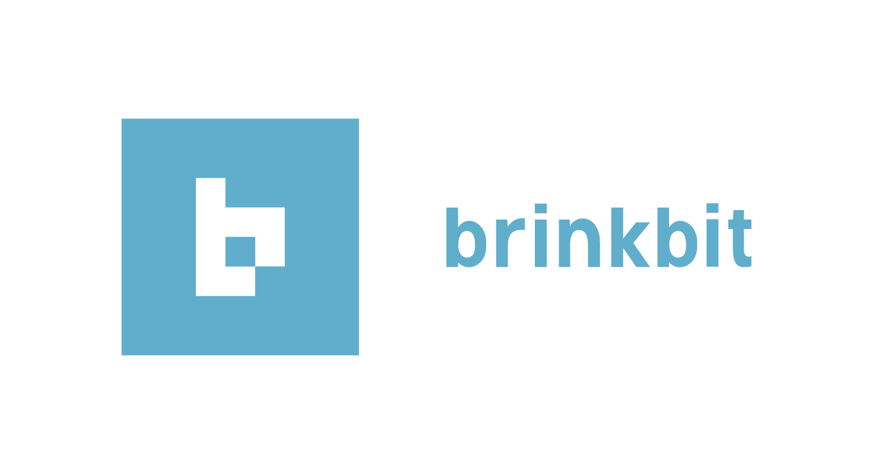

# [](https://brinkbit.com)

> fast, extensible, and scalable BaaS platform for game services, content management, live ops, and more

This is the client-side javascript SDK for the [Brinkbit Game BaaS](https://brinkbit.com/).
This repository includes installation instructions and basic examples.
For full API documentation see [https://brinkbit.com/docs/](https://brinkbit.com/docs/).

## Contents

- [Installation](#installation)
- [Examples](#examples)
- [Links](#links)

## Installation

### Via npm

```console
$ npm init
$ npm install --save brinkbit.js
```

### Via yarn

```console
$ yarn init
$ yarn add brinkbit.js
```

### Via cdn

Include the following script tag in your html:

```html
<script crossorigin src="https://unpkg.com/brinkbit.js/dist/brinkbit.min.js"></script>
```

## Examples

### Import

CommonJS
```javascript
const Brinkbit = require( 'brinkbit.js' );
```

ES6
```javascript
import Brinkbit from 'brinkbit.js';
```

### Initialize

```javascript
// create a new Brinkbit instance
const brinkbit = new Brinkbit({
    gameId: 'xxxxxxxx-xxxx-Mxxx-Nxxx-xxxxxxxxxxxx', // your unique game id (can be retrieved from brinkbit control center)
});
```

```javascript
// create a new Brinkbit instance using custom proxy
const brinkbit = new Brinkbit({
    base: 'https://yourproxydomain.com/api/', // the route of your application on which the server-side sdk is listening
    gameId: 'xxxxxxxx-xxxx-Mxxx-Nxxx-xxxxxxxxxxxx', // your unique game id (can be retrieved from brinkbit control center)
});
```

### Create a New Player

```javascript
// create a new player
const player = new brinkbit.Player({
    username: 'Violet',
    email: 'violet@trialbyfireball.com',
    password: 'FireballsAreTheWorst',
});
player.save()
.then(() => {
    // player has been created on server
});
```

### Login

```javascript
brinkbit.on( 'login', ( event ) => {
    console.log( event.player );
});

// login a player
brinkbit.login({
    username: 'Violet', // can also be email
    password: 'FireballsAreTheWorst',
})
.then(( player ) => {
    // player is an authenticated player object
    // You can also access the primary player via Brinkbit.Player.primary
    console.log( player.id === Brinkbit.Player.primary.id );
});
```

### Check if Logged In

```javascript
if ( brinkbit.loggedIn()) {
    console.log( 'player is logged in' );
}
else {
    console.log( 'player is not logged in' );
}
```

### Logout

```javascript
brinkbit.logout();
// player is logged out

// alternative
player.logout();
```

### Low Level Requests

```javascript
brinkbit.get( '/players/12345/' )
.then(( response ) => {
    console.log( response );
});
```

```javascript
brinkbit.put({
    uri: '/players/12345/',
    data: {
        email: 'violet2@trialbyfireball.com',
    },
});
```

## Links

[](https://github.com/brinkbit/)
[](https://facebook.com/brinkbit/)
[](https://twitter.com/brinkbit/)
[](https://www.linkedin.com/company/brinkbit/)
[](https://google.com/+brinkbit/)
[](https://medium.com/brinkbit/)
